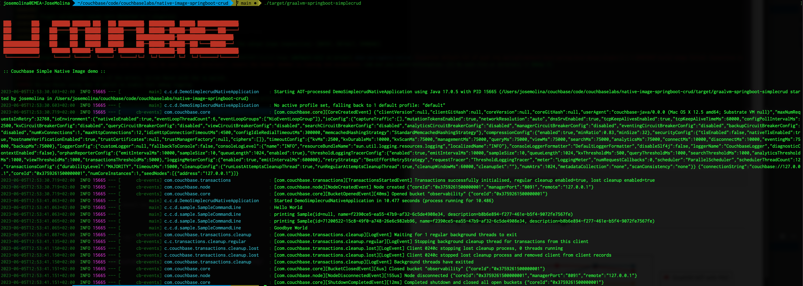
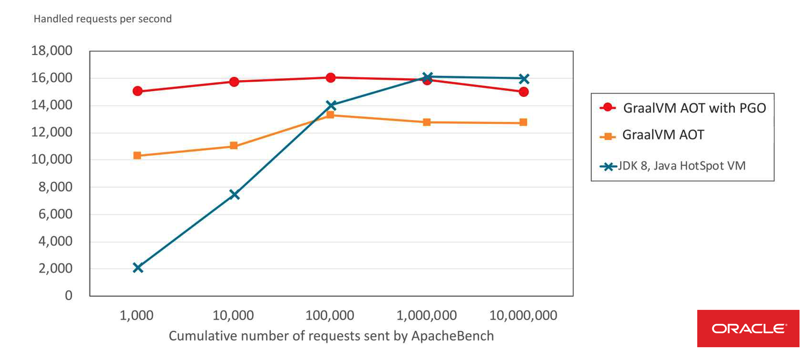

# Couchbase SDK with GraalVM Native Image generation


GraalVM + Springboot 3.x + Couchbase Java SDK 

**GraalVM Native Images** provide a new way to deploy and run Java applications. Compared to the Java Virtual Machine, native images can run with a smaller memory footprint and with much faster startup times.

They are well suited to applications that are deployed using container images and are especially interesting when combined with "Function as a service" (FaaS) platforms.

Unlike traditional applications written for the JVM, GraalVM Native Image applications require **ahead-of-time processing** in order to create an executable. This **ahead-of-time processing** involves statically analyzing your application code from its main entry point.

A **GraalVM Native Image** is a complete, platform-specific executable. You do not need to ship a Java Virtual Machine in order to run a native image.


0. Prerequisites
1. Quick Start
2. Why Running Java with GraalVM Native Image? 
3. Maven Native Image pluging
4. Gradle configuration
5. GraalVM Agent
6. Troubleshooting 
7. To do list...


## 0. Pre-requisites 

Install GraalVM JRE [Getting Started Link](https://www.graalvm.org/22.0/docs/getting-started/)

```
```

Note: If you are using macOS Catalina and later you may need to remove the quarantine attribute from the bits before you can use them
To do this, run the following:

```
$ sudo xattr -r -d com.apple.quarantine path/to/graalvm/
```

GraalVM Native Image plugin

Maven +3.6

```
```

Docker

```
```


## 1. Quick Start


```
mvn clean spring-boot:build-image -Pnative
```

```
./target/graalvm-springboot-simplecrud 
```




## 2. Why GraalVM Native Image



* Source: Thomas Wuerthinger - [Maximizing Performance with GraalVM](https://www.infoq.com/presentations/graalvm-performance/)


## 3. Configuration


### 3.1. Maven Native Image Plugin

```
   ...
   <plugin>
        <groupId>org.graalvm.buildtools</groupId>
        <artifactId>native-maven-plugin</artifactId>
        ...
    </plugin>
```


### 3.2. Gradle Configuration (TODO)


## 4. GraalVM Agent


## 5. Troubleshooting


## 6. To do list


## 7. References

*
